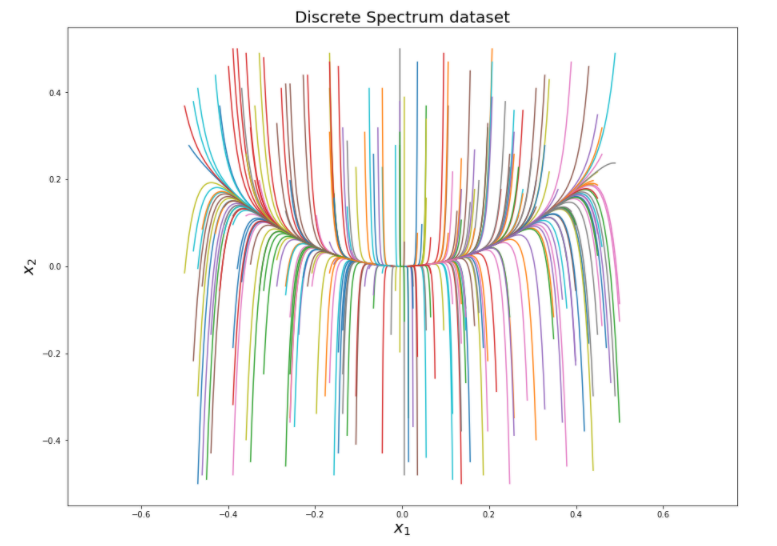

Consider a simple nonlinear discrete spectrum system, described as follows: 

$$\dot{x_{1}} = \mu x_{1}$$

$$\dot{x_{2}} = \lambda (x_{2} - x_{1}^{2})$$

Given the input data we measure the dynamic mode decomposition accuracy by equation (6) and (7). As a result, $L_{2} =  0.000327$ and $L_{3} = 5.055e-05$, whereas in the latent space dataset $\tilde(y)$, $L_{2} =  0.0003006$ and $L_{3} = 0.0002703$. While the DMD loss decreased, the predictability loss did not improve. There is more room for improvement by adjusting the network's hyper-parameters. 
