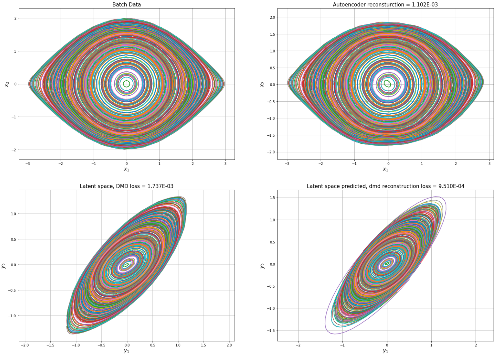

Consider the simple pendulum which is a nonlinear continuous spectra systems, described as follow: 
 
$$\dot{x_{1}} = x_{2}$$
    
$$\dot{x_{2}} = -\sin(x_{1})$$

with the potential function $\frac{1}{2}x_{2}^{2} - \cos(x_{1})$.

Given the input data we measure the dynamic mode decomposition accuracy by equation (6) and (7). As a result, $L_{2} = 1.574 × 10^{-1}$ and $L_{3} = 2.658 × 10^{-2}$, whereas in the latent space dataset $Y$, $L_{2} =  1.737 x 10^{-3}$ and $L_{3} = 9.51 x 10^{-4}$. These results show that the encoder network finds a mapping which the nonlinear dynamics become approximately linear. 

The figure above shows the phase portrait of the nonlinear pendulum. The simple DMD autoencoder attempts to reconstruct the input data and is shown in figure 1b. Figure 1c shows the dynamic mode decomposition reconstruction of the latent space forming near circles. The simple DMD autoencoder does not account for continuous spectra and is used as a pretrain for the Koopman autoencoder developed by Lusch et al [[1]]((https://arxiv.org/pdf/1712.09707.pdf)). This model is saved under `models/my_model_Ex2_oct21` and can be loaded easily, see the Jupyter notebook `compare_full_machine_results_pendulum.ipynb`. 